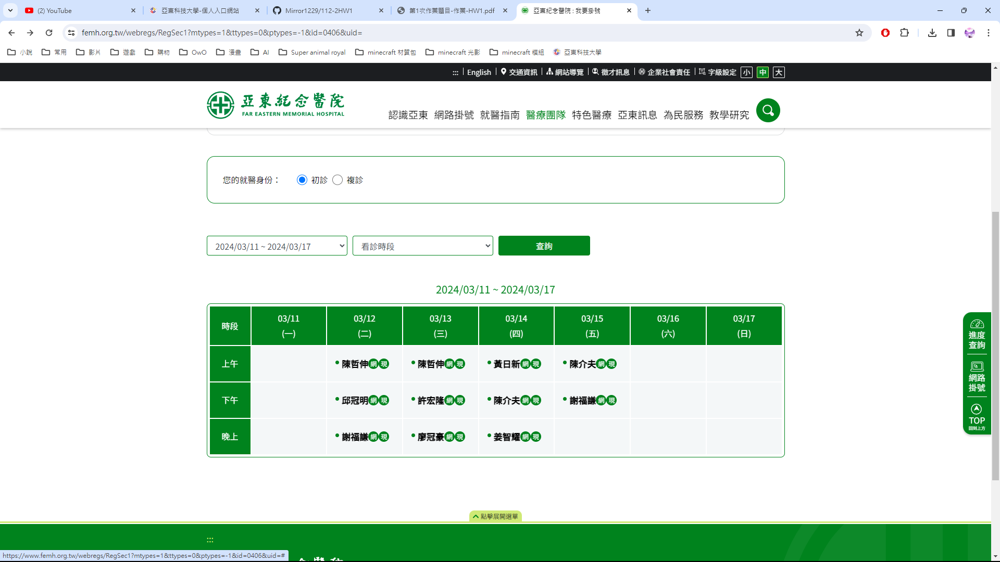
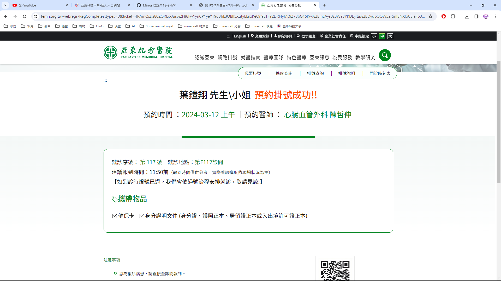
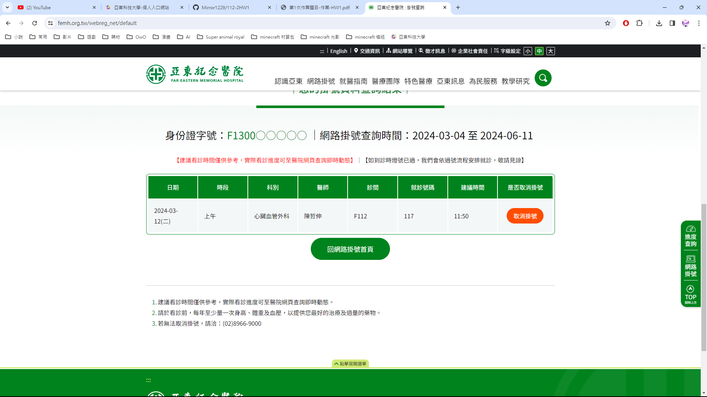

# 第1次作業-作業-HW1
>
>學號：111111114
> 
>姓名：葉鎧翔
> 
>作業撰寫時間：30分鐘
> 
>最後撰寫文件日期：2024/3/4
>

本份文件包含以下主題：(至少需下面兩項，若是有多者可以自行新增)
- [x] 說明內容
- [x] 個人認為完成作業須具備觀念

## 說明程式與內容
利用add,commit,push，保存在倉庫跟伺服器端。
 掛號
 掛號成功
 取消掛號
## 個人認為完成作業須具備觀念

利用add把新增或修改的東西標示出來，之後用commit推到倉庫，再利用push把倉庫的推到伺服器端。